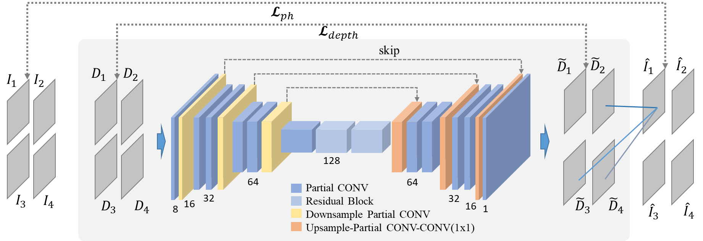

# Self-supervised Deep Depth Denoising
Created by [Vladimiros Sterzentsenko](https://github.com/vladsterz)__\*__, [Leonidas Saroglou](https://github.com/LeoSarog)__\*__, [Anargyros Chatzitofis](https://github.com/tofis)__\*__, [Spyridon Thermos](https://github.com/spthermo)__\*__, [Nikolaos](https://github.com/zokin) [Zioulis](https://github.com/zuru)__\*__, [Alexandros Doumanoglou](https://www.iti.gr/iti/people/Alexandros_Doumanoglou.html), [Dimitrios Zarpalas](https://www.iti.gr/iti/people/Dimitrios_Zarpalas.html), and [Petros Daras](https://www.iti.gr/iti/people/Petros_Daras.html) from the [Visual Computing Lab](https://vcl.iti.gr) @ CERTH


# About this repo
This repo includes the training and evaluation scripts for the fully convolutional autoencoder presented in our paper ["Self-Supervised Deep Depth Denoising"](https://arxiv.org/pdf/1909.01193.pdf) (to appear in [ICCV 2019](http://iccv2019.thecvf.com/)). The autoencoder is trained in a self-supervised manner, exploiting RGB-D data captured by Intel RealSense D415 sensors. During inference, the model is used for depthmap denoising, without the need of RGB data.

# Installation
The code has been tested with the following setup:
  * Pytorch 1.0.1
  * Python 3.7.2
  * CUDA 9.1
  * [Visdom](https://github.com/facebookresearch/visdom)

# Model Architecture



**Encoder**: 9 CONV layers, input is downsampled 3 times prior to the latent space, number of channels doubled after each downsampling.

**Bottleneck**: 2 residual blocks, ELU-CONV-ELU-CONV structure, pre-activation.

**Decoder**: 9 CONV layers, input is upsampled 3 times using interpolation followed by a CONV layer.

# Train
To see the available training parameters:

```python train.py -h```

Training example:

```python train.py --batchsize 2 --epochs 20 --lr 0.00002 --visdom --visdom_iters 500 --disp_iters 10 --train_path /path/to/train/set```

# Inference
The weights of pretrained models can be downloaded from [here](https://github.com/VCL3D/DeepDepthDenoising/releases):
 * ddd --> trained with multi-view supervision (as presented in the paper):
 * ddd_ae --> same model architecture, no multi-view supervision (for comparison purposes)

To denoise a RealSense sample using a pretrained model:

```python inference.py --model_path /path/to/pretrained/model --input_path /path/to/noisy/sample --output_path /path/to/save/denoised/sample```

In order to save the input (noisy) and the output (denoised) samples as pointclouds add the following flag to the inference script execution:

```--pointclouds True```

To denoise a sample using the pretrained autoencoder (same model trained without splatting) add the following flag to the inference script (and make sure you load the "ddd_ae" model):

```--autoencoder True```

**Benchmarking:** the mean inference time on a GeForce GTX 1080 GPU is **11ms**.

# Citation
If you use this code and/or models, please cite the following:
```
@inproceedings{sterzentsenko2019denoising,
  author       = "Vladimiros Sterzentsenko and Leonidas Saroglou and Anargyros Chatzitofis and Spyridon Thermos and Nikolaos Zioulis and Alexandros Doumanoglou and Dimitrios Zarpalas and Petros Daras",
  title        = "Self-Supervised Deep Depth Denoising",
  booktitle    = "ICCV",
  year         = "2019"
}
```

# License
Our code is released under MIT License (see LICENSE file for details)
