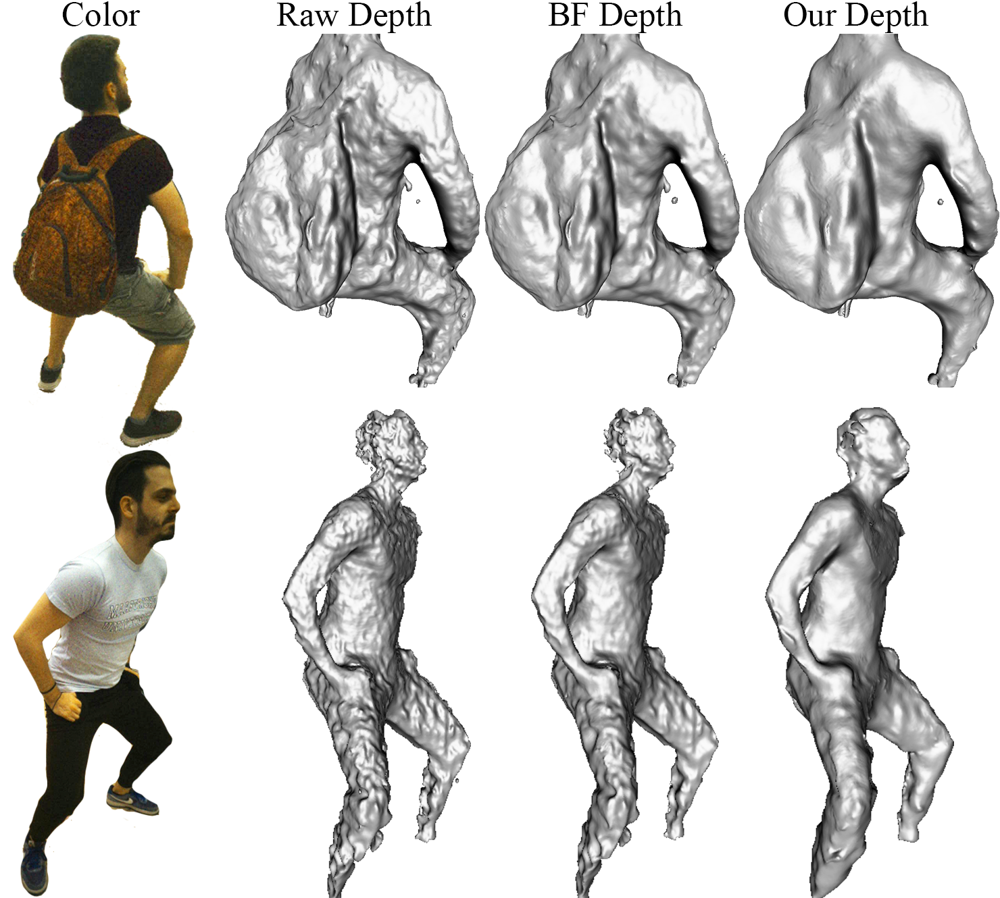
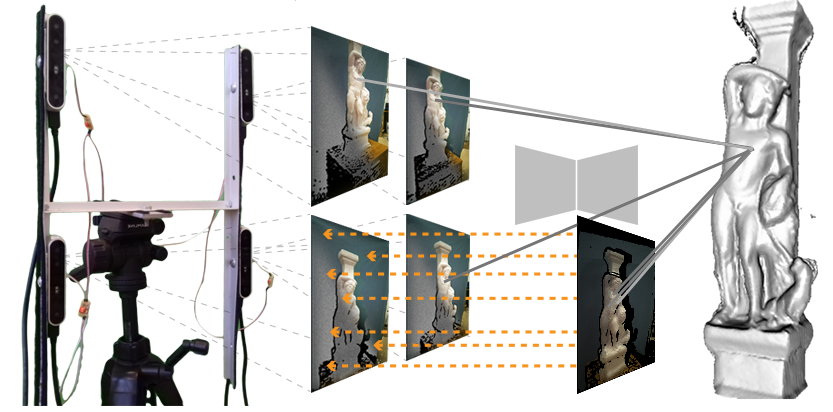
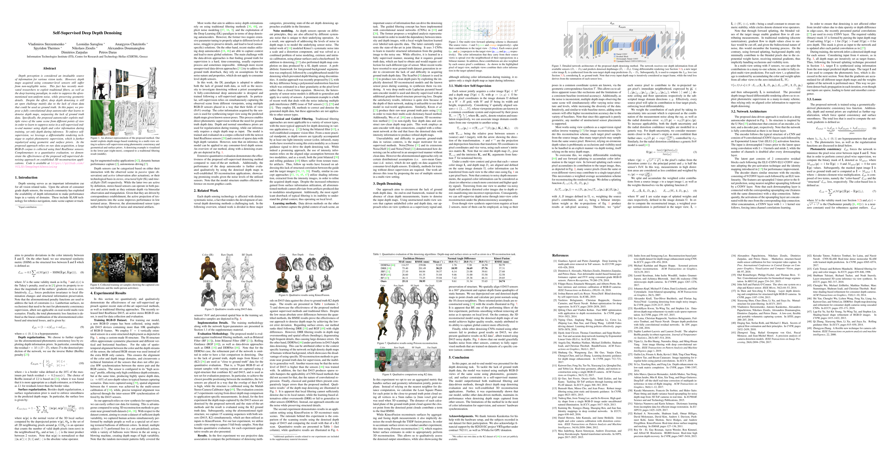
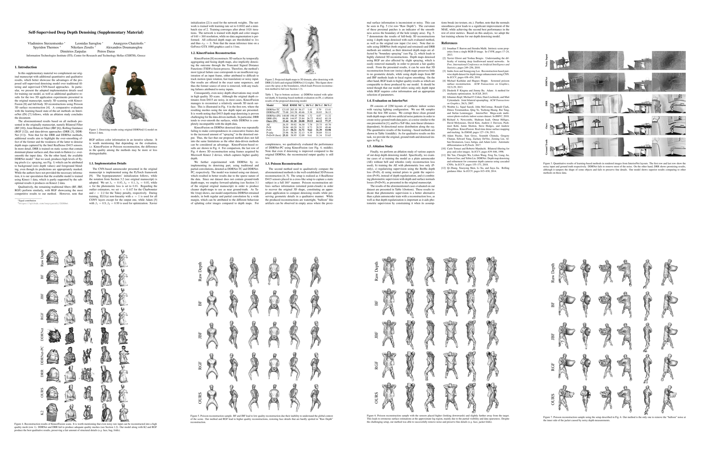

# Abstract
Depth perception is considered an invaluable sourceof information for various vision tasks. However, depth maps acquired using consumer-level sensors still suffer from non-negligible noise. This fact has recently motivated researchers to exploit traditional filters, as well as the deep learning paradigm, in order to suppress the aforementioned non-uniform noise, while preserving geometric details. Despite the effort, deep depth denoising is still an open challenge mainly due to the lack of clean data that could be used as ground truth. In this paper, we propose a fully convolutional deep autoencoder that learns to denoise depth maps, surpassing the lack of ground truth data. Specifically, the proposed autoencoder exploits multiple views of the same scene from different points of view in order to learn to suppress noise in a self-supervised endto- end manner using depth and color information during training, yet only depth during inference. To enforce selfsupervision, we leverage a differentiable rendering technique to exploit photometric supervision, which is further regularized using geometric and surface priors. As the proposed approach relies on raw data acquisition, a large RGB-D corpus is collected using Intel RealSense sensors. Complementary to a quantitative evaluation, we demonstrate the effectiveness of the proposed self-supervised denoising approach on established 3D reconstruction applications.

# Model Overview


# H-structure


# Publication
The paper is available in [arxiv](https://arxiv.org)

## Paper
[](https://arxiv.org)
## Supplementary
[](https://arxiv.org)
# Authors
[Vladimiros Sterzentsenko](https://github.com/vladsterz)__*__, [Leonidas Saroglou](https://www.iti.gr/iti/people/Leonidas_Saroglou.html)__*__, [Anargyros Chatzitofis](https://github.com/tofis)__*__, [Spyridon Thermos](https://github.com/spthermo)__*__, [Nikolaos](https://github.com/zokin)  [Zioulis](https://github.com/zuru)__*__, [Alexandros Doumanoglou](https://www.iti.gr/iti/people/Alexandros_Doumanoglou.html), [Dimitrios Zarpalas](https://www.iti.gr/iti/people/Dimitrios_Zarpalas.html), and [Petros Daras](https://www.iti.gr/iti/people/Petros_Daras.html)

[Visual Computing Lab (VCL)](https://vcl.iti.gr)

# Citation
If you use this code and/or data, please cite the following:
```
@inproceedings{sterzentsenko2019denoising,
  author       = "Vladimiros Sterzentsenko and Leonidas Saroglou and Anargyros Chatzitofis and Spyridon Thermos and Nikolaos Zioulis and Alexandros Doumanoglou and Dimitrios Zarpalas and Petros Daras",
  title        = "Self-Supervised Deep Depth Denoising",
  booktitle    = "ICCV",
  year         = "2019"
}
```

# Acknowledgements
We thank the anonymous reviewers for helpful comments.

This project has received funding from the European Union’s Horizon 2020 innovation programme [VRTogether](https://vrtogether.eu/) under grant agreement No 762111.

We would like to thank NVIDIA for supporting our research with GPU donations through the NVIDIA GPU Grant Program.


# Contact
Please direct any questions related to the code & models to [vladster@iti.gr](mailto:vladster@iti.gr) or post an issue to the code [repo](https://github.com/VCL3D/DeepDepthDenoising).
