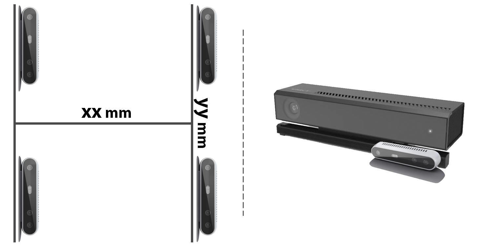

# Abstract
Depth perception is considered an invaluable sourceof information for various vision tasks. However, depth maps acquired using consumer-level sensors still suffer from non-negligible noise. This fact has recently motivated researchers to exploit traditional filters, as well as the deep learning paradigm, in order to suppress the aforementioned non-uniform noise, while preserving geometric details. Despite the effort, deep depth denoising is still an open challenge mainly due to the lack of clean data that could be used as ground truth. In this paper, we propose a fully convolutional deep autoencoder that learns to denoise depth maps, surpassing the lack of ground truth data. Specifically, the proposed autoencoder exploits multiple views of the same scene from different points of view in order to learn to suppress noise in a self-supervised endto- end manner using depth and color information during training, yet only depth during inference. To enforce selfsupervision, we leverage a differentiable rendering technique to exploit photometric supervision, which is further regularized using geometric and surface priors. As the proposed approach relies on raw data acquisition, a large RGB-D corpus is collected using Intel RealSense sensors. Complementary to a quantitative evaluation, we demonstrate the effectiveness of the proposed self-supervised denoising approach on established 3D reconstruction applications.

# Model Overview

# H-structure

# Publication
## Paper

## Supplementary

# Authors

# Citation

# Acknowledgements
